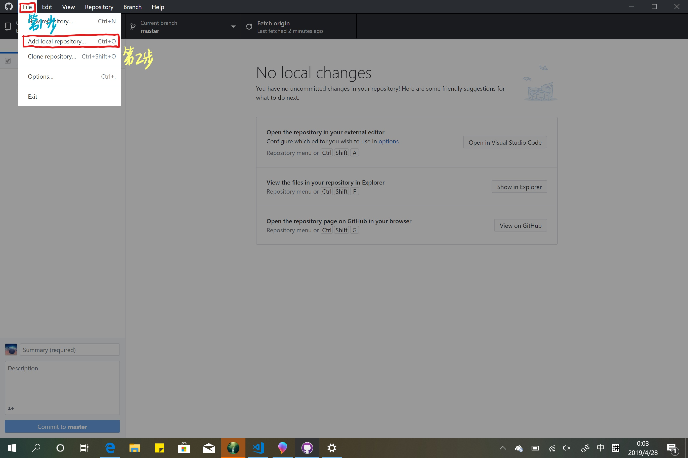
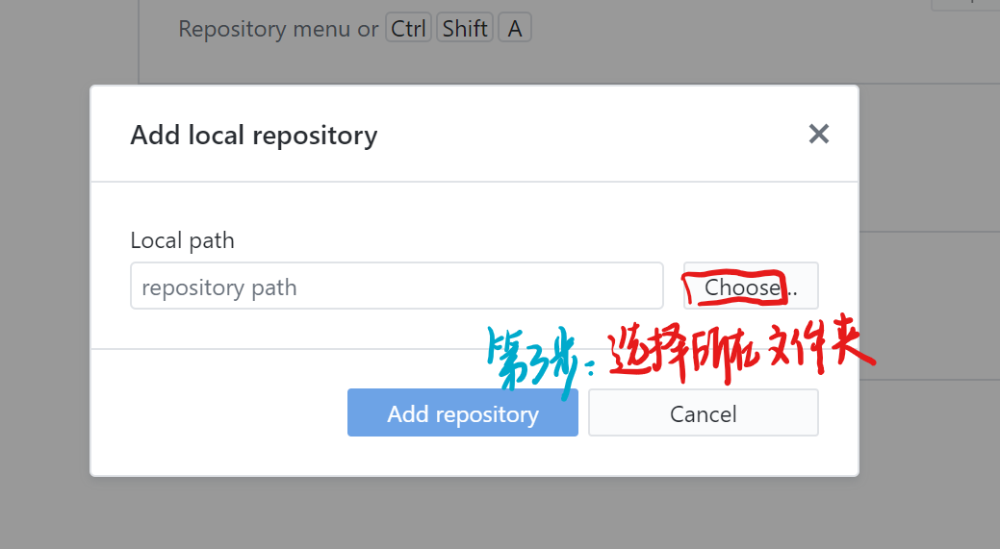
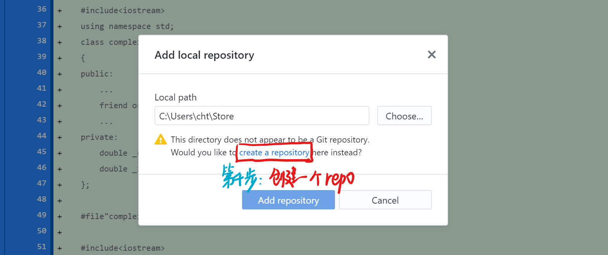
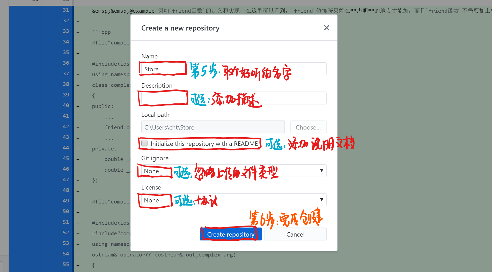
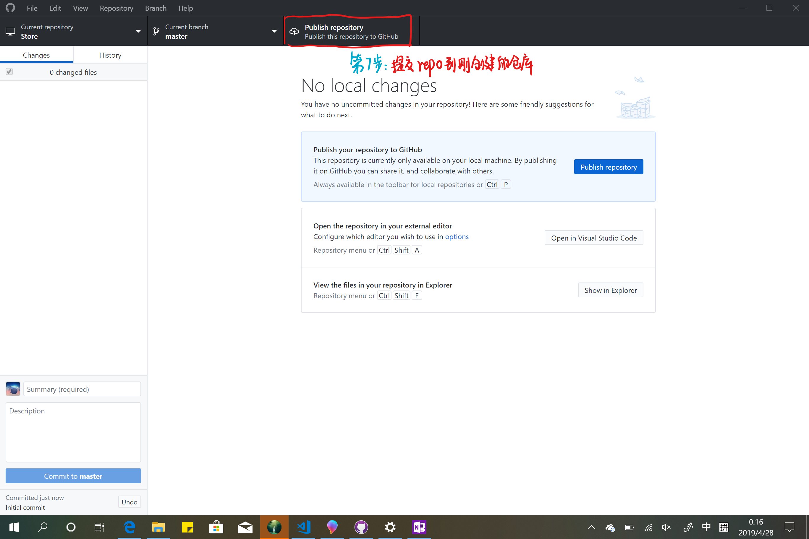
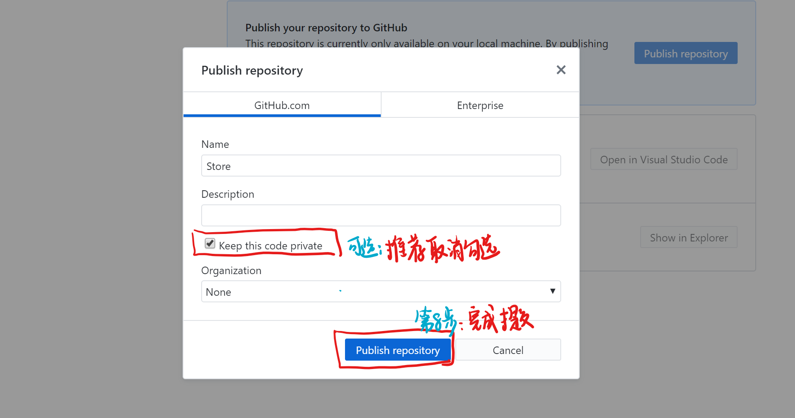
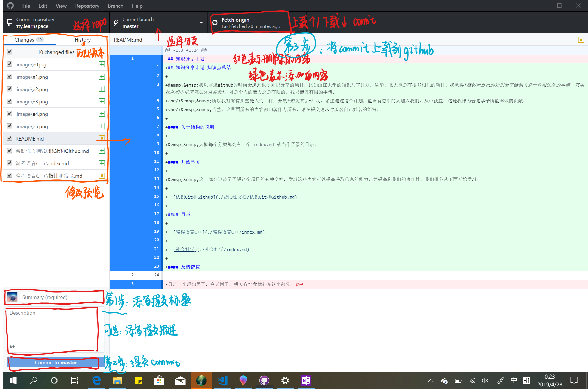
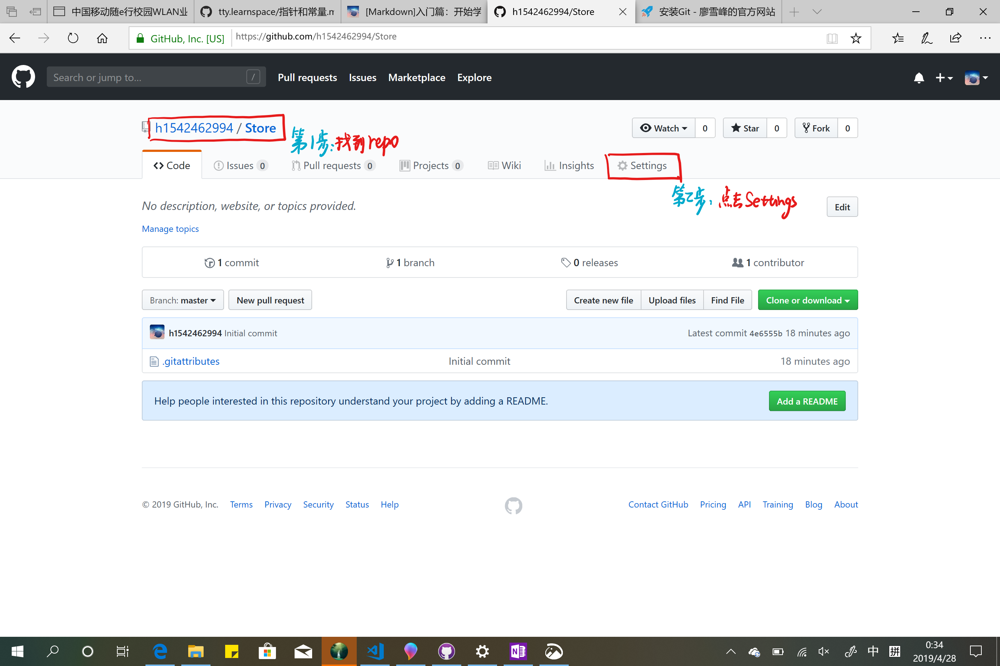
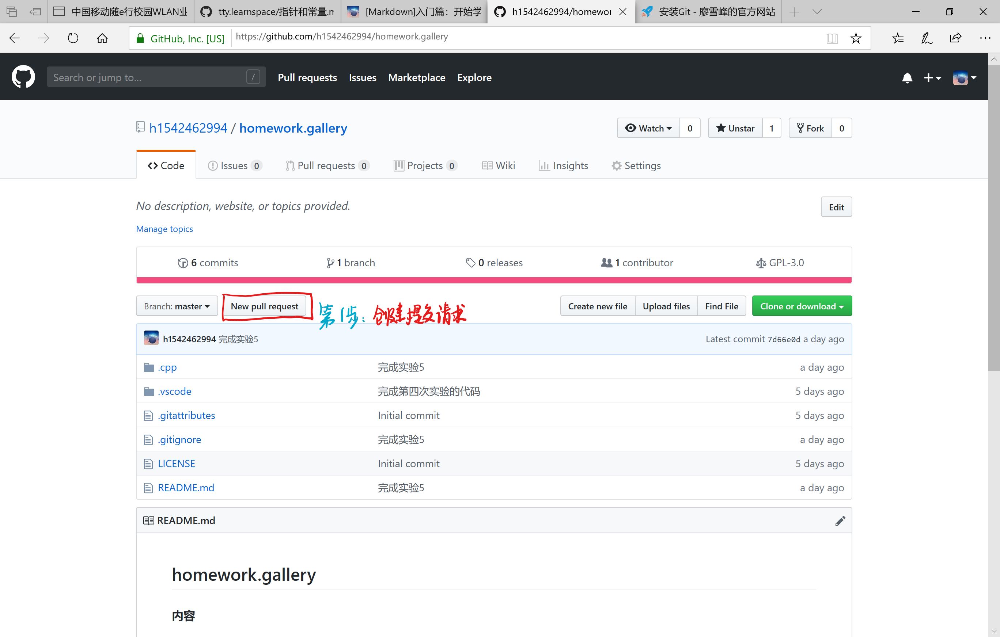
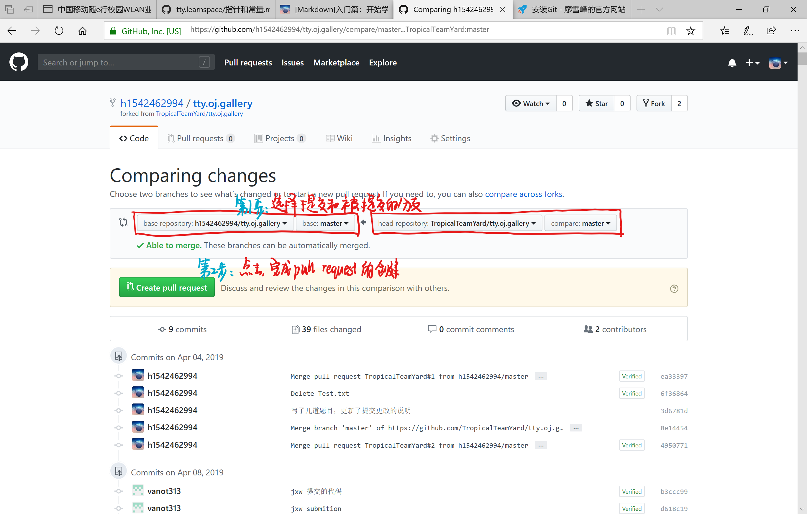

## 认识Git和Github

> [返回上级](../README.md)

#### Git

&emsp;&emsp;`git`是一个开源的版本控制系统，所谓**版本控制**，主要是指其能回退到历史版本，查看当前版本的更改。所以`git`是一个很有用的工具。如果要学习怎么使用`git`，请[单击链接(别人的博客)](https://www.liaoxuefeng.com/wiki/0013739516305929606dd18361248578c67b8067c8c017b000/)
 &emsp;&emsp;当然，因为是外国的网站，下载`git`还是有点慢的，所以请大家`科学上网`。

#### Github

&emsp;&emsp;`github`是全球最大的同性交友平台，所以，~~为了顺应时代潮流~~，为了方便管理文档和代码，也为了能够帮助大家成为一名优秀的程序员，我教大家怎么轻松而又愉快地玩耍`github`。
 &emsp;&emsp;`github`是一个全球的版本控制仓库，**版本控制**是因为这个平台不单单存储一个时期的文件内容，而是存储文件的各个版本的更新，**仓库**是因为其汇集了全世界大多数的**开源代码**。要更多地了解github，请[单击链接](https://guides.github.com/activities/hello-world/)。
 &emsp;&emsp;`github`有三个版本，[网页版](https://github.com/)，[桌面版下载链接](https://desktop.github.com/)，移动端。其中移动端是第三方的一个叫做`openhub`的软件。

#### Github的基础操作

&emsp;&emsp;`github`还是比较容易学会的，为了学好它，你需要理解`github`实际上也是一个版本管理工具。

##### 创建账号

&emsp;&emsp;打开`github`官网，然后单击`sign up`，按照官方的提示做即可。

##### 创建repo

&emsp;&emsp;`repo`是一个基本单位（不是最小单位），一个`repo`可以有多个`branch`，一个`branch`可以有很多个`commit`。`repo`指一个项目，通常是一个`c/c++`项目或者一个文件夹，`branch`表示分支，两个分支可以独立，并且能够合并两个分支，`commit`是指一个提交，当你更改玩代码后，你便可以提交。
 &emsp;&emsp;一般来说，创建repo在`github desktop`上进行，步骤如下，一般来说，这样你就创建了一个`repo`了。

##### 提交你的更改（commit）

&emsp;&emsp;当你需要在`github`上的版本和你当前的版本一直，则需要`commit`。`commit`还是很简单的。

##### 解决冲突

&emsp;&emsp;这种情况在个人开发的情况下出现的几率较小，而在一个团队开发同一个软件是经常遇到。暂时先不写这个部分。

##### 删除repo

&emsp;&emsp;这个功能只有在网页版中才能实现，步骤如下。

然后拖到最底部的`Danger Zone`，单击`Delete this repository`，然后按照提示就可以删除这个`repo`了。

> 这个举动十分危险，请想好后再做

##### 提交请求

&emsp;&emsp;`pull request`是`github`被戏称为全球最大同性交友网站的原因，所以，当然是要掌握这一个精髓的操作的。`pull request`常常在我没有权限修改`repo`或者合并`repo`时才会用到，这个功能也是需要通过网页版来完成的，步骤如下。

相信通过学习，你也可以愉快地玩耍`github`了。

> Author:cht.
